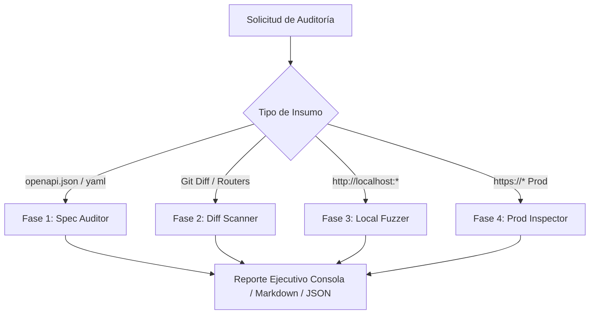

# 🛡️ API Guardian

[](https://www.python.org/)
[](LICENSE)
[](https://owasp.org/www-project-api-security/)

**API Guardian** es un motor de auditoría defensiva y una **Skill para agentes de IA (Antigravity)** diseñado para examinar y proteger APIs antes de probarlas en local y antes de enviarlas a producción.

Está concebido para funcionar tanto en **proyectos independientes** como en **grandes corporaciones con millones de líneas de código**, resolviendo el problema de escala mediante análisis diferencial y por capas.

---

## 🎯 El Problema en Grandes Empresas y la Solución

En proyectos con codebases masivas, es inviable y costoso pedirle a un desarrollador o a un modelo de IA que lea todo el repositorio en cada cambio. 

**API Guardian** implementa el modelo **Shift-Left en 4 fases**:
1. **Contratos (OpenAPI):** Detecta fallos de arquitectura y diseño antes de programar.
2. **Escaneo Diferencial (Git Diff):** En lugar de todo el repositorio, audita únicamente los routers y controladores modificados en el PR/commit actual contra vulnerabilidades como BOLA/IDOR o Mass Assignment.
3. **Fuzzing Seguro en Local:** Prueba el servidor local contra edge-cases para evitar caídas `500 Internal Server Error`.
4. **Inspección Pasiva en Producción:** Verifica cabeceras, políticas CORS y exposición de endpoints sin ejecutar ataques destructivos.



---

## 🚀 Instalación y Uso Rápido

No requiere dependencias externas obligatorias para su funcionamiento base (utiliza la librería estándar de Python).

```bash
# Clonar el proyecto
git clone https://github.com/tu-usuario/api-guardian.git
cd api-guardian

# Ejecutable directamente con Python
python3 -m api_guardian --help
```

---

## 💡 Modos de Uso

### 1. Auditoría de Contrato OpenAPI / Swagger
Analiza esquemas de autenticación, parámetros sensibles en query strings y falta de paginación:
```bash
python3 -m api_guardian spec openapi.json --save
```

### 2. Escaneo Diferencial en Grandes Repositorios (Git Diff)
Ideal para Pull Requests o antes de hacer commit en proyectos inmensos:
```bash
# Analizar endpoints modificados contra origin/main
python3 -m api_guardian diff --base origin/main

# O auditar un controlador específico
python3 -m api_guardian file src/controllers/user.controller.ts
```

### 3. Fuzzing de Robustez en Local (Localhost)
Valida que tu API local maneje errores correctamente devolviendo `400/422` y **nunca un `500` no controlado**:
```bash
python3 -m api_guardian local http://localhost:8000 --endpoints /api/v1/auth/login,/api/v1/orders
```
*(Incluye un **Safeguard** que rechaza por defecto ejecutarse contra dominios externos para evitar caídas accidentales).*

### 4. Inspección Pasiva en Producción
Auditoría segura sin impacto para APIs en producción (TLS, HSTS, CORS permisivo, `/actuator`, `/.env`):
```bash
python3 -m api_guardian prod https://api.tuempresa.com --save
```

### 5. Detección Automática (`scan`)
El modo inteligente detecta automáticamente si el objetivo es una URL, un archivo de especificación, un archivo de código o una carpeta Git:
```bash
python3 -m api_guardian scan openapi.json
python3 -m api_guardian scan https://api.tuempresa.com
```

---

## 🤖 Uso como Skill en Antigravity / Gemini Agent

El repositorio incluye el archivo [SKILL.md](file:///home/david/Documentos/mis_proyectos(Github)/api-guardian/SKILL.md). Cuando le pides al asistente en tu IDE o CLI:

> *"Examina mi API antes de probarla en local"* o *"Audita los cambios en mis endpoints contra OWASP"*

El agente consulta automáticamente el árbol de decisión de `SKILL.md` y ejecuta los módulos pertinentes generando un reporte estructurado con severidad, impacto y la remediación exacta en código.

---

## 📊 Matriz de Cobertura OWASP API Security Top 10 (2023)

| ID OWASP | Categoría | Módulo que lo detecta |
| :--- | :--- | :---: |
| **API1:2023** | Broken Object Level Authorization (BOLA/IDOR) | `diff` / `file` |
| **API2:2023** | Broken Authentication (Tokens en query / Hardcoded secrets) | `spec` / `diff` |
| **API3:2023** | Broken Object Property Level Authorization (Mass Assignment) | `spec` / `diff` |
| **API4:2023** | Unrestricted Resource Consumption (Falta de límites / paginación) | `spec` / `prod` |
| **API8:2023** | Security Misconfiguration (CORS, HSTS, Fugas de stack trace) | `diff` / `prod` / `local` |

---

## 🧪 Ejecutar Pruebas Automatizadas

El proyecto cuenta con una suite completa de pruebas unitarias:
```bash
python3 -m unittest discover tests
```

---

## 📄 Licencia
Distribuido bajo la Licencia MIT.
