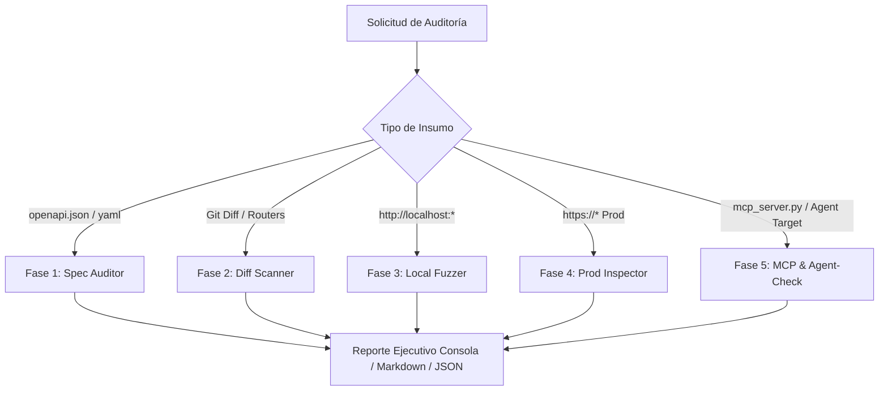

# 🛡️ API Guardian

[](https://www.python.org/)
[](LICENSE)
[](https://owasp.org/www-project-api-security/)
[-purple.svg)](https://modelcontextprotocol.io/)

**API Guardian** es un motor de auditoría defensiva y una **Skill para agentes de IA (Antigravity)** diseñado para examinar y proteger APIs antes de probarlas en local y antes de enviarlas a producción.

Está concebido para funcionar tanto en **proyectos independientes** como en **grandes corporaciones con millones de líneas de código**, resolviendo el problema de escala mediante análisis diferencial, por capas y verificación de compatibilidad **Agent-Ready**.

---

## 🎯 El Problema en Grandes Empresas y la Solución

En proyectos con codebases masivas, es inviable y costoso pedirle a un desarrollador o a un modelo de IA que lea todo el repositorio en cada cambio. 

**API Guardian** implementa el modelo **Shift-Left en 5 fases**:
1. **Contratos (OpenAPI 3.x):** Detecta fallos de arquitectura, SSRF, falta de paginación o límites de memoria antes de programar.
2. **Escaneo Diferencial (Git Diff):** Audita únicamente los routers y controladores modificados en el PR/commit actual contra vulnerabilidades como BOLA/IDOR, Mass Assignment, RCE o SSRF saliente.
3. **Fuzzing Seguro en Local:** Prueba el servidor local contra edge-cases para evitar caídas `500 Internal Server Error`.
4. **Inspección Pasiva en Producción:** Verifica cabeceras, políticas CORS y exposición de endpoints sin ejecutar ataques destructivos.
5. **Auditoría Agent-Ready & MCP:** Evalúa si la API y las herramientas expuestas vía **Model Context Protocol (MCP)** son seguras contra alucinaciones, prompt injections y reintentos automáticos de agentes LLM.



---

## 🚀 Instalación y Uso Rápido

No requiere dependencias externas obligatorias para su funcionamiento base (utiliza la librería estándar de Python).

```bash
# Clonar el proyecto
git clone https://github.com/11julio11/api-guardian.git
cd api-guardian

# Ejecutable directamente con Python
python3 -m api_guardian --help
```

---

## 💡 Modos de Uso

### 1. Auditoría de Contrato OpenAPI / Swagger
Analiza esquemas de autenticación, SSRF, parámetros sensibles en query strings, límites de tamaño (DoS) y paginación:
```bash
python3 -m api_guardian spec openapi.json --save
```

### 2. Escaneo Diferencial en Grandes Repositorios (Git Diff)
Ideal para Pull Requests o antes de hacer commit en proyectos inmensos:
```bash
# Analizar endpoints modificados contra origin/main
python3 -m api_guardian diff --base origin/main

# O auditar un controlador específico
python3 -m api_guardian file src/controllers/user.controller.ts
```

### 3. Diagnóstico y Ejecución de Servidores MCP (Model Context Protocol)
Valida que tu servidor de herramientas MCP cumpla con la especificación JSON-RPC 2.0 (stdio) para asistentes como Cursor, Claude Desktop y Antigravity:
```bash
# Diagnóstico de handshake, herramientas y esquemas:
python3 -m api_guardian mcp test examples/agent_ready_api/app/mcp_server.py

# Ejecución nativa del servidor MCP en stdio:
python3 -m api_guardian mcp run examples/agent_ready_api/app/mcp_server.py
```

### 4. Evaluación de Preparación para Agentes IA (`agent-check`)
Calcula el puntaje de seguridad (Score 0-100) evaluando aislamiento Multi-Tenant (RLS), Idempotencia (`Idempotency-Key`), formato RFC 9457 y claridad de descripciones para LLMs:
```bash
python3 -m api_guardian agent-check openapi.json
```

### 5. Fuzzing de Robustez en Local (Localhost)
Valida que tu API local maneje errores correctamente devolviendo `400/422` y **nunca un `500` no controlado**:
```bash
python3 -m api_guardian local http://localhost:8000 --endpoints /api/v1/auth/login,/api/v1/orders
```
*(Incluye un **Safeguard** que rechaza por defecto ejecutarse contra dominios externos para evitar caídas accidentales).*

### 6. Inspección Pasiva en Producción
Auditoría segura sin impacto para APIs en producción (TLS, HSTS, CORS permisivo, `/actuator`, `/.env`):
```bash
python3 -m api_guardian prod https://api.tuempresa.com --save
```

### 7. Inicialización de Proyecto y CI/CD (`init`)
Genera la configuración `.api-guardian.json` y el pipeline para GitHub Actions:
```bash
python3 -m api_guardian init
```

---

## 📊 Matriz de Cobertura OWASP API Security Top 10 (2023) & Agent-Ready

| ID OWASP / Estándar | Categoría | Regla / Módulo |
| :--- | :--- | :---: |
| **API1:2023** | Broken Object Level Authorization (BOLA/IDOR) | `API-DIFF-005` (`diff` / `file`) |
| **API2:2023** | Broken Authentication (Tokens en query / Hardcoded secrets) | `API-SPEC-002`, `API-SPEC-004`, `API-DIFF-001` |
| **API3:2023** | Broken Object Property Level Authorization (Mass Assignment) | `API-SPEC-006`, `API-DIFF-003` |
| **API4:2023** | Unrestricted Resource Consumption (Falta de límites / paginación) | `API-SPEC-005`, `API-SPEC-008` (maxLength/maxItems) |
| **API7:2023** | Server-Side Request Forgery (SSRF en endpoints y salientes) | `API-SPEC-007`, `API-DIFF-006` |
| **API8:2023** | Security Misconfiguration & Inyecciones (RCE, CORS, HSTS) | `API-DIFF-002`, `API-DIFF-007`, `API-DIFF-008`, `API-PROD-005` |
| **API9:2023** | Improper Inventory Management (Rutas no versionadas o deprecadas) | `API-SPEC-010` (`spec`) |
| **AGENT-READY** | Multi-Tenant RLS & Agent Safety (No tenant_id en body) | `API-AGENT-002` (`spec` / `diff` / `agent-check`) |
| **AGENT-READY** | Idempotencia ante reintentos de agentes (Idempotency-Key) | `API-AGENT-001` (`spec` / `agent-check`) |
| **AGENT-READY** | Semántica de Auto-Corrección para LLMs (RFC 9457) | `API-AGENT-003` (`spec` / `agent-check`) |
| **AGENT-READY** | Completitud de Prompts/Descripciones de Herramientas para IA | `API-SPEC-009` (`spec` / `agent-check`) |

---

## 🧪 Pruebas Automatizadas

El proyecto cuenta con una suite completa de pruebas unitarias y de integración sobre subprocesos reales (sin simulaciones vacías ni mocks):
```bash
python3 -m unittest discover tests
```

---

## 📄 Licencia
Distribuido bajo la Licencia MIT.
