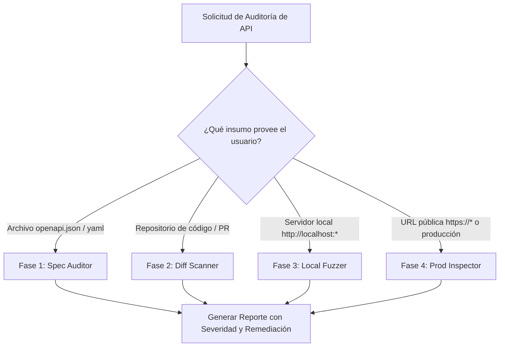

# API Guardian - Skill de Auditoría y Protección de APIs

Esta skill capacita al agente para evaluar contratos de API (OpenAPI/Swagger), escanear código diferencialmente en grandes repositorios (Git diff / AST), ejecutar pruebas de robustez seguras en local (`localhost`) y auditar la postura defensiva en producción de forma 100% pasiva.

---

## 🎯 Cuándo Activar esta Skill

Activa esta skill cuando el usuario pida:
* "Revisa mi API antes de probarla en local o desplegarla a producción".
* "Audita la seguridad de mis endpoints contra OWASP API Security Top 10".
* "Verifica si mi API tiene vulnerabilidades como BOLA, IDOR, Mass Assignment o secretos expuestos".
* "Examina este archivo OpenAPI/Swagger (`openapi.json` o `swagger.yaml`)".
* "Revisa las cabeceras de seguridad, CORS o límites de tasa de mi API en producción".
* "Prueba la robustez de mi API local ante excepciones o payloads inesperados".

---

## 🧭 Árbol de Decisión por Entorno



---

## 📋 Flujo de Ejecución Paso a Paso

### Fase 1: Auditoría de Contrato (Spec Auditor)
Úsalo cuando exista un archivo OpenAPI / Swagger (`openapi.json`, `openapi.yaml`, etc.).
1. Ejecuta el comando de inspección de especificación:
   ```bash
   python3 -m api_guardian spec ruta/a/openapi.json --format console
   ```
2. **Qué evalúa:**
   * Esquemas de autenticación ausentes en mutaciones (`POST`, `PUT`, `DELETE`).
   * Exposición de parámetros sensibles en query strings (`?token=`, `?api_key=`).
   * Endpoints de colección (listas) sin parámetros de paginación (`limit`, `page`, `offset`).
   * Atributos privilegiados en el cuerpo de peticiones (`role`, `is_admin`, `balance`).

---

### Fase 2: Escaneo Diferencial en Grandes Repositorios (Diff Scanner)
En empresas grandes con cientos de miles de líneas de código, **no analices todo el repositorio**. Utiliza el escáner diferencial para enfocarte en los endpoints modificados en el PR o commit actual.
1. Ejecuta el escaneo diferencial:
   ```bash
   # Contra la rama principal
   python3 -m api_guardian diff --base origin/main
   
   # O sobre un archivo de controlador/router específico:
   python3 -m api_guardian file src/controllers/user.controller.ts
   ```
2. **Puntos de auditoría crítica (OWASP API 2023):**
   * **BOLA / IDOR:** Asegurar que las consultas por ID (`findById(id)`) validen que el recurso pertenezca a la empresa o usuario de la sesión (`WHERE id = :id AND tenant_id = :tenant_id`).
   * **Mass Assignment:** Detectar si se pasan objetos directos del cliente a la base de datos (`Model.create(req.body)`).
   * **Inyección SQL:** Validar que no existan concatenaciones de texto en queries.
   * **Fuga de Excepciones:** Verificar que los bloques `catch` no retornen `err.stack` al cliente.

---

### Fase 3: Pruebas de Robustez en Local (Local Fuzzer)
Úsalo cuando el desarrollador tenga el servidor levantado en su máquina (`http://localhost:PORT`).
1. Ejecuta el fuzzer de robustez seguro:
   ```bash
   python3 -m api_guardian local http://localhost:8000 --endpoints /api/v1/auth/login,/api/v1/users --method POST
   ```
2. **Regla de Oro:**
   * Una API bien construida debe responder `400 Bad Request` o `422 Unprocessable Entity` ante payloads malformados.
   * **Si responde `500 Internal Server Error`, es un fallo crítico de robustez** que debe ser remediado con validadores de esquema (Zod, Pydantic, DTOs).
   * Por seguridad, el fuzzer cuenta con un *Safeguard*: no se ejecutará contra dominios públicos de internet a menos que se indique explícitamente.

---

### Fase 4: Auditoría Pasiva en Producción (Prod Inspector)
Para APIs desplegadas en producción o staging remoto.
1. **Regla de Seguridad Empresarial:** **ESTRICTAMENTE PASIVA**. No realizar ataques de denegación de servicio, no inyectar datos falsos y no ejecutar mutaciones `POST/DELETE` destructivas.
2. Ejecuta la inspección pasiva:
   ```bash
   python3 -m api_guardian prod https://api.tuempresa.com --save
   ```
3. **Puntos auditados:**
   * **CORS Inseguro:** Verificar que no refleje orígenes arbitrarios con `Access-Control-Allow-Credentials: true`.
   * **Cabeceras defensivas:** Presencia de `Strict-Transport-Security` (HSTS), `X-Content-Type-Options: nosniff`.
   * **Fugas de información:** Detección de endpoints administrativos expuestos (`/.env`, `/.git/HEAD`, `/actuator`, `/metrics`).
   * **Rate Limiting:** Existencia de cabeceras de límite de tasa (`RateLimit-*`).

---

## 📊 Formato Obligatorio del Reporte al Usuario

Cuando presentes los resultados al usuario, utiliza el formato estándar de **API Guardian**:

```markdown
### 🔴 [HIGH] Nombre del Hallazgo (`API-XXX-000`)
- **Ubicación:** `archivo.ts:línea` o `MÉTODO /ruta`
- **Categoría:** OWASP API Security (ej. API1:2023 - BOLA)
- **Problema:** Explicación precisa de qué causa la vulnerabilidad.
- **Impacto:** Qué podría lograr un atacante (robo de datos, DoS, escalada de privilegios).

**🛠️ Remediación Recomendada:**
```lenguaje
// ❌ Vulnerable:
...
// ✅ Seguro:
...
```
```
